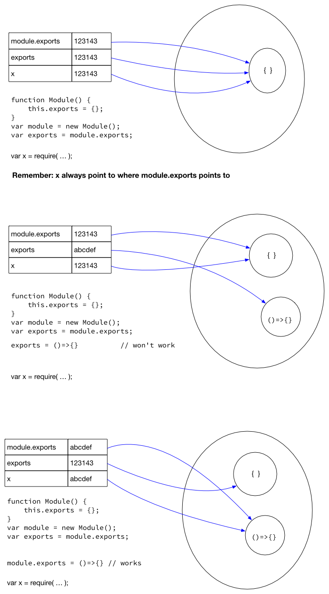
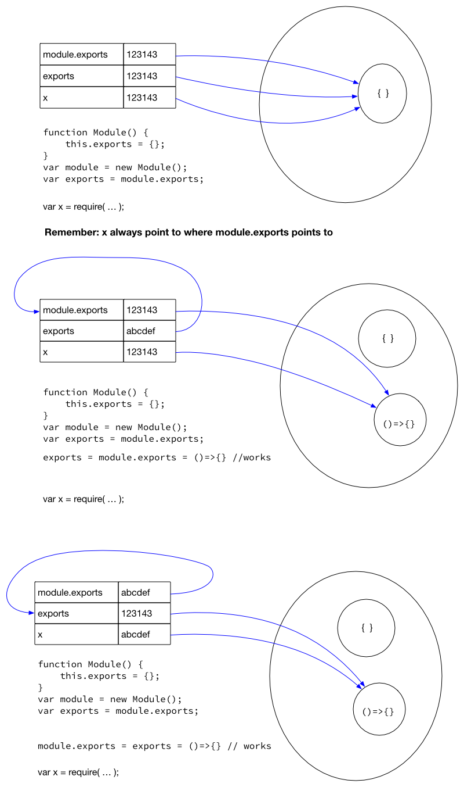
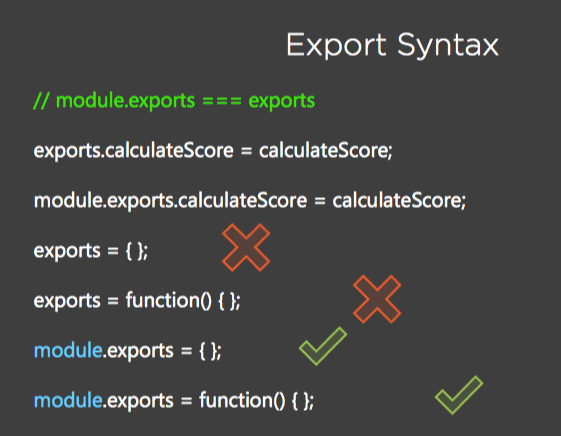

# NodeJS: exports and module.exports


### What is the difference between exports and module.exports?

My understanding after reading:

https://blog.tableflip.io/the-difference-between-module-exports-and-exports/

https://www.sitepoint.com/understanding-module-exports-exports-node-js/

https://www.hacksparrow.com/nodejs/exports-vs-module-exports.html

https://stackoverflow.com/questions/7137397/module-exports-vs-exports-in-node-js


---

Lets first answer this question: *During node execution where is the variable `exports` and `module` come from?*

Consider you have a module called `my-module.js`

```javascript
// my-module.js
const myProperty = 'foo'
export.myProperty = myProperty
```

During node execution you can imagine your code is copied and added to node.js internal:

```javascript
NativeModule.wrapper = [
  '(
     function (exports, require, module, __filename, __dirname) { ',
       const myProperty = 'foo' \n
       export.myProperty = myProperty  '\n
     }
   );'
];
```

(ref: [node-v0.x-archive](https://github.com/nodejs/node-v0.x-archive/blob/832ec1cd507ed344badd2ed97d3da92975650a95/src/node.js#L792-L795)). You can see in above that the variables `exports` and `module` is passed in as formal-parameters of the function.  During execution, this function is being called:

```javascript
const module = {
  ...
}
const exports = {}
module.export = exports

NativeModule.warpper[0](export, require, module, ....)
```

(ref: [this](https://github.com/nodejs/node-v0.x-archive/blob/832ec1cd507ed344badd2ed97d3da92975650a95/src/node.js#L802), [this](https://github.com/nodejs/node-v0.x-archive/blob/832ec1cd507ed344badd2ed97d3da92975650a95/src/node.js#L802)) In another word, node execution point both `exports` and `module.exports` to the same object. To show this:

```javascript
/// try-this.js
console.dir(module)

console.log('exports === module.exports: ', exports === module.exports)
```

Result:

```
$ node try-this.js
Module {
  ....
  exports: {},
  ....
}
exports === module.exports:  true
```

Because `exports` and `module.exports` are point to the same object, any property added to `exports` can be accessed by `module.exports`.

```javascript
/// try-this-2.js
exports.fooBar = 'fooBar'
console.dir(module)
module.exports.fooBar = 'Hello'
console.log(exports)
```

Result:

```
$ node try-this-2.js
Module {
  .....
  exports: { fooBar: 'fooBar' },
  .....
}
{ fooBar: 'Hello' }
```

So if you reassign either `exports` or `module.exports` they will no longer be pointing to the same reference.

This kind of reassignment is often done in ComomnJS to simulate [ECMA script module's default export](https://nodejs.org/dist/latest-v12.x/docs/api/esm.html#esm_import_statements) so that an ECMA scripts module can perform default import from a CommonJS module:

```javascript
/// folder: default-export
/// file: main.mjs (ESM)
import defaultCjs from './dependee.cjs'
console.log(defaultCjs)

/// file: dependee.cjs (CommonJS)
module.exports = 'default from CommonJS'
```

```
$ node main.mjs
default from CommonJS
```

 ⚠️ Be aware the reassignment should always be done on the `module.exports` but not on the `exports` because it is the object `module` being exported and acquired by the consumer.  So if we had reassign `exports` instead of `module.exports`, you would see the wrong result:

```javascript
/// folder: default-export--wrong
/// file: main.mjs (ESM)
import defaultCjs from './dependee.cjs'
console.log(defaultCjs)

/// file: dependee.cjs (CommonJS)
exports = 'default from CommonJS'
```

```
$ node main.mjs
{}
```

In the above you see that it is the initial object being exported, not the string `"default from CommonJS"` we had reassigned to the variable `exports`.

You may ask what is the purpose of `exports` if it is the object `module` finally being exported instead of `exports`? This is being asked and explained in the comment of this https://stackoverflow.com/a/26451885/3136861:

>
> So then, what's the point of using `exports`? Why not just always use `module.exports` if it's just a variable reassignment? Seems confusing to me.
>
> – [jedd.ahyoung](https://stackoverflow.com/users/677526/jedd-ahyoung)


> @jedd.ahyoung by adding properties to `exports` you are effectively ensuring that you are returning a "typical" module export *object*. In contrast, by using `module.exports` you can return any value you want (primitive, array, function) and not just an object (which is the format most people expect). So `module.exports` offers more power but can also be used to have your module export atypical values (like a primitive). In contrast `exports` is more limiting but safer (so long as you simply add properties to it and don't reassign it).
>
> – [Marcus Junius Brutus](https://stackoverflow.com/users/274677/marcus-junius-brutus)


----

### My 2016 Studies 

The following are a diagram I made in 2016 when I first study this subject: 

**How exports work:**



#### When export stop working




### Here is an image I found on internet to summarize:



